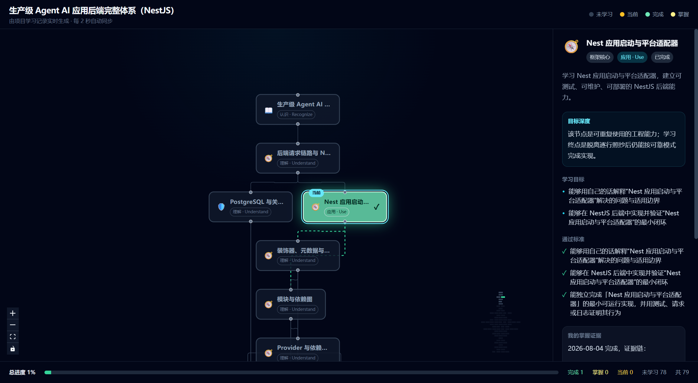

<div align="center">

# MapFlow · 技能树学习可视化

**把一条学习路线变成一棵会生长的技能树**

自动布局的节点依赖图 · 完成状态实时着色 · 节点掌握即触发完成特效



</div>

## 它是什么

MapFlow 是一个**技能树可视化前端**：每一个学习节点（技能）按依赖关系排成树状图，节点颜色实时反映学习状态——未学习 / 学习中 / 已完成 / 已掌握。点击节点可以查看它的推荐学习深度、学习目标、关键概念与验收证据。

```
未学习 ○     学习中 ●     已完成 ●     已掌握 ●
```

> 当前仓库自带一份 **NestJS 后端开发**演示技能树，克隆下来 `npm run dev` 即可看到完整交互效果，无需任何后端。

## 特性

- **自动布局**：基于 dagre 的紧凑分层布局，节点多也清晰不重叠
- **实时状态着色**：节点按学习进度自动着色，一眼看出当前学到哪
- **节点完成特效**：节点状态翻转（学习 → 完成）时触发全屏闪光动画
- **深度分层**：每个节点标注推荐学习深度（认识 / 理解 / 应用 / 迁移 / 深度掌握）
- **详情面板**：点击节点查看学习目标、关键概念、验收证据
- **演示模式**：无后端时自动展示内置演示树，有后端时无缝切换真实数据

## 快速开始

```bash
npm install
npm run dev
```

浏览器打开 `http://localhost:5173`，即可看到完整技能树。

## 接入真实数据

前端从 `GET /api/learning/tree` 读取技能树快照（自动每 2 秒轮询同步）。接入你的后端后，只需让该接口返回如下结构的 JSON：

```json
{
  "tree": { "id": "...", "title": "...", "topic": "...", "total_nodes": 8 },
  "nodes": [
    {
      "id": "node-1",
      "title": "依赖注入",
      "icon": "wrench",
      "category": "框架核心",
      "depth_level": 2,
      "recommended_depth": "Use",
      "learning_objectives": "[\"理解 IoC 容器\"]",
      "key_concepts": "[\"DI\", \"provider\"]",
      "observable_evidence": "能自定义一个服务并注入使用"
    }
  ],
  "edges": [{ "id": "e1", "source_node_id": "node-1", "target_node_id": "node-2" }],
  "current_node_id": "node-3",
  "progress": [{ "node_id": "node-1", "status": "completed", "evidence": "..." }]
}
```

**节点状态取值**：`not_started` / `in_progress` / `completed` / `mastered`
**推荐深度取值**：`Recognize` / `Understand` / `Use` / `Transfer` / `DeepMastery`
**图标键**：`compass` `shield` `code` `database` `brain` `network` `server` `cloud` `wrench` `book`

接口不可用时前端自动回退到内置演示树，页面不会白屏。

## 技术栈

React 18 · TypeScript · Vite · React Flow (@xyflow/react) · dagre · Tailwind CSS · TanStack Query

## 许可证

MIT
