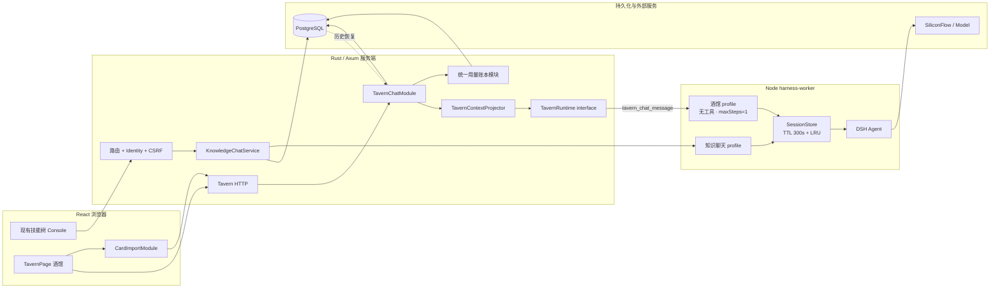

# MapFlow 当前架构与酒馆接入导览

日期：2026-09-20

配套总图：[mapflow-tavern-architecture.svg](./mapflow-tavern-architecture.svg)

## 1. 先抓住一个核心区别

MapFlow 同时存在两种状态：

- **业务事实**必须放在 PostgreSQL：账号归属、角色卡、会话、原始消息、模型用量和扣费。
- **运行时加速状态**可以放在 Node worker 内存：DSH Agent Handle、已组装上下文和最近活跃时间。

因此，worker 的 Session 被 TTL/LRU 回收不等于聊天丢失。下一次请求由 Rust 从 PostgreSQL 读取历史，再通过独立 Runtime 接口恢复 DSH Session。

## 2. 总体结构

## 3. 四条必须看懂的链路

### 3.1 HTTP 与业务链

浏览器只提交意图。Axum 路由负责身份、CSRF、限流和协议转换；`TavernChatModule` 才负责账号归属、并发、幂等和事务。HTTP 处理器不能直接写表或调用 worker。

Review 时问：绕开 UI 直接发 HTTP 请求，服务端是否仍然执行同样的权限和状态检查？

### 3.2 Runtime 链

`TavernChatModule` 通过窄的 `TavernRuntime` interface 调用 DSH。Rust 发送独立 `tavern_chat_message`，Node 进入独立酒馆 profile；它没有工具字段，不会落入知识树聊天的 `web_search` 或改树逻辑。

Review 时问：角色卡内容是否可能改变 profile、工具权限、步数或模型配置？答案必须始终是否。

### 3.3 历史与 TTL 链

成功回合先持久化为原始用户／助手消息。worker 只缓存热 Session。空闲 300 秒后 Session 可以删除；Rust 收到 `session_missing` 后，携带数据库历史重试一次。恢复失败返回稳定错误，不无限重试，也不重复扣费。

Review 时问：删除的是内存缓存还是业务记录？恢复请求有没有稳定幂等键？

### 3.4 积分链

积分余额由“发放账本减用量账本”得出。知识聊天和酒馆聊天都在保存成功回合的同一事务里写一条 `credit_usage_ledger`；业务回合表中的 `charged_credit_units` 只是审计明细，不再被余额查询重复扣减。

Review 时问：模型成功但数据库失败时是否扣费？同一个 `client_turn_id` 重试是否会产生第二条用量？答案都必须是否。

## 4. 世界书和词表怎样进入模型

1. Rust 从数据库取得规范化角色、当前消息、最近四个完整回合，以及可选词表。
2. `TavernContextProjector` 选择常驻和关键词命中的世界书条目，生成结构化 `TavernTurnContext`。
3. Node 是唯一的模型文本渲染器，把结构化 context 渲染为稳定 JSON。
4. 酒馆 DSH scope 注册 `mapflow:tavern-turn` runtime context；原始用户消息仍原样进入 `followup`。
5. 动态 context 只存在于 DSH 运行时投影，不写进数据库的用户消息。Session 恢复时重新计算。

这条单向链避免 Rust、Node、HTTP 三处各自拼一份提示词。

## 5. 角色卡导入的信任边界

浏览器负责把 PNG/JSON 转为 MapFlow `NormalizedCharacterCard`。服务端把这个版本化 JSON 当作权威输入重新校验。可选原始文件只用于来源留存和 PNG 头像；`source_hash` 与 `normalized_hash` 分别记录，但系统不声称二者内容对应。

角色卡是提示内容，不是代码和权限配置。脚本、MVU、EJS、HTML 面板和卡片中的工具指令都不能执行。

## 6. 你最值得亲自 Review 的位置

| 决策 | 为什么需要你判断 |
| --- | --- |
| 产品范围和交互 | 是否真的有趣、词表是否应该注入，只有产品所有者能决定 |
| 表结构和迁移 | 错误会影响既有积分、历史和回滚 |
| 权限与信任边界 | 决定角色卡能碰到什么，属于安全与产品承诺 |
| Runtime interface | 决定酒馆是否会和知识聊天继续耦合 |
| 上下文预算与裁剪 | 直接影响角色还原度、成本和长会话稳定性 |

普通组件拆分、字段搬运和测试样板可以交给 AI 实现，但上述五类决策不应只由实现者自审。

## 7. 建议阅读顺序

1. 前端路由和页面状态：`D:/MapFlow-publish/src/App.tsx`
2. HTTP 组装：`D:/mapflow-server/src/app.rs`、`src/http/knowledge_chat.rs`
3. 业务请求构造：`D:/mapflow-server/src/application/knowledge_chat.rs`
4. 回合事务和余额：`src/adapters/postgres/knowledge_chat_store.rs`、`credit_store.rs`
5. Rust Runtime Adapter：`src/adapters/agent_runtime/deepseek_harness.rs`
6. Node worker：`harness-worker/src/protocol.ts`、`harness-worker/src/harness.ts`

读每一层时只回答三个问题：输入是什么、谁拥有状态、失败后留下什么。能回答这三个问题，就已经足以 Review 这次酒馆设计，不需要先读懂整个仓库。
